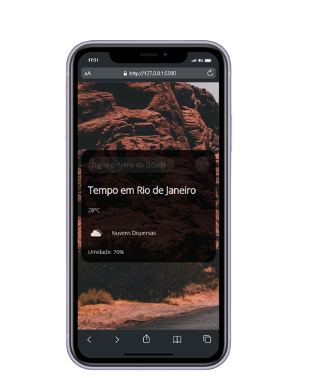

<h1 align="center"> Projeto Previsão do Tempo </h1>

 Neste site utilizei a API https://openweathermap.org/ que descreve as informações climáticas que determinados locais estão no momento. 

<h3> O projeto foi realizado com as ferramentas:</h3>

<ul>
<li>HTML</li>
</ul>

<ul>
<li>CSS</li>
</ul>

<ul>
<li>JAVASCRIPT</li>
</ul>
 

 

<h2> Deploy : </h2>

<a href = "https://previsaodotempoglobal.netlify.app/"> PREVISÃO DO TEMPO </a>
 

